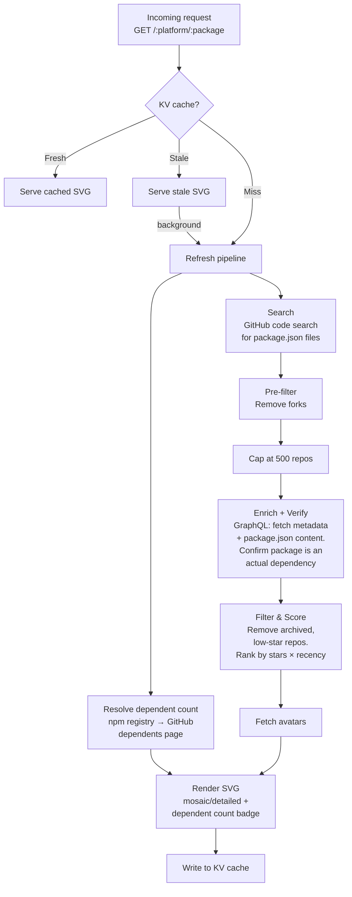

# `@usedby.dev/worker`

Cloudflare Worker that serves the embeddable image endpoint and handles the data pipeline.

## How it works



### Pipeline stages

1. **Search** — Queries GitHub code search for `"packageName" filename:package.json` (up to 10 pages of 100 results). Matches include any `package.json` mentioning the name, which can produce false positives (mentions in descriptions, scripts, partial name matches).
2. **Resolve dependent count** _(parallel with search)_ — Fetches the npm registry to resolve the package's GitHub repo, then scrapes GitHub's `/:owner/:repo/network/dependents` page to extract the total repository dependent count. This adds 2 subrequests but zero latency since it runs concurrently with search.
3. **Pre-filter** — Removes forks. Fork status from code search is reliable, so filtering early saves enrichment budget.
4. **Cap** — Slices to 500 repos to stay within the enrichment budget (10 GraphQL batches of 50).
5. **Enrich + Verify** — A single GraphQL query per batch fetches repo metadata (stars, archived status, last push) _and_ the matched `package.json` content via `object(expression: "HEAD:path")`. The file is parsed and verified: repos where the package is not listed in `dependencies`, `devDependencies`, `peerDependencies`, or `optionalDependencies` are discarded as false positives. This costs zero additional subrequests.
6. **Filter & Score** — Removes archived repos and those with fewer than 5 stars. Remaining repos are ranked by `stars * recency_multiplier` (half-life decay over 1 year).
7. **Fetch avatars** — Downloads avatar images for the top results.
8. **Render** — Produces an SVG (mosaic or detailed) with a "Used by N repositories" pill badge when the dependent count is available, and writes it to KV cache.

## Image endpoint

```
GET /:platform/:package
```

Example: `GET /npm/dinero.js` returns an SVG image.

### Query parameters

| Parameter | Type    | Default  | Description                                                                                                                                                     |
| --------- | ------- | -------- | --------------------------------------------------------------------------------------------------------------------------------------------------------------- |
| `max`     | integer | `100`    | Number of dependents to display (1–100). Higher values use more subrequests (each avatar = 1 fetch).                                                            |
| `style`   | string  | `mosaic` | Rendering style. `mosaic` shows an avatar-only grid (10 columns, 70px avatars). `detailed` shows a 3-column card layout with avatar, repo name, and star count. |
| `sort`    | string  | `score`  | Sort order. `score` ranks by `stars × recency_multiplier` (composite score). `stars` ranks by raw star count.                                                   |
| `theme`   | string  | `auto`   | Color theme. `auto` adapts to the user's system preference via `prefers-color-scheme`. `light` and `dark` force a specific mode.                                |

## Badge endpoint

```
GET /:platform/:package/shield.json
```

Returns a [Shields.io endpoint badge](https://shields.io/badges/endpoint-badge) JSON response with the number of dependents for a package.

### Usage with Shields.io

```
https://img.shields.io/endpoint?url=https://api.usedby.dev/{platform}/{package}/shield.json
```

Example for `dinero.js` on npm:

```markdown

```

### Supported registries

| Platform   | Example                                   |
| ---------- | ----------------------------------------- |
| `npm`      | `/npm/dinero.js/shield.json`              |
| `rubygems` | `/rubygems/rails/shield.json`             |
| `pypi`     | `/pypi/django/shield.json`                |
| `cargo`    | `/cargo/serde/shield.json`                |
| `composer` | `/composer/laravel/framework/shield.json` |
| `go`       | `/go/gorilla/mux/shield.json`             |

### Response format

```json
{
  "schemaVersion": 1,
  "label": "used by",
  "message": "1.2K+ projects",
  "color": "brightgreen"
}
```

| Field           | Type    | Description                                                                                          |
| --------------- | ------- | ---------------------------------------------------------------------------------------------------- |
| `schemaVersion` | integer | Always `1` (Shields.io schema version).                                                              |
| `label`         | string  | Always `"used by"`.                                                                                  |
| `message`       | string  | Formatted count (e.g. `"42 projects"`, `"1.2K+ projects"`). `"unavailable"` or `"error"` on failure. |
| `color`         | string  | `"brightgreen"` when count > 0, `"lightgrey"` when 0 or unavailable, `"red"` on error.               |
| `isError`       | boolean | Present and `true` only on error responses.                                                          |

Counts are formatted for readability: exact below 1,000, then abbreviated (`1.2K+`, `42K+`, `1.5M+`).

### Caching

Same stale-while-revalidate strategy as the image endpoint: 24-hour `Cache-Control` (`max-age=86400`), serve stale while refreshing in the background, 30-day KV eviction.

### Count-only entries

The badge endpoint is lightweight. On a cache miss, it creates a **count-only** KV entry (dependent count without full repo data), which avoids the expensive search + enrichment pipeline. A subsequent image request for the same package upgrades the entry to a full entry with repo details.

## Development

Create a `.dev.vars` file with your GitHub token:

```
GITHUB_TOKEN=ghp_your_token_here
```

Then start the local server:

```sh
npm run dev
```

The worker runs at [http://localhost:8787](http://localhost:8787).

To clear the local KV cache:

```sh
rm -rf .wrangler/state
```

## Deployment

```sh
npm run deploy
```

Requires `GITHUB_TOKEN` set via `wrangler secret put GITHUB_TOKEN`.

## Testing

```sh
npm test
```
