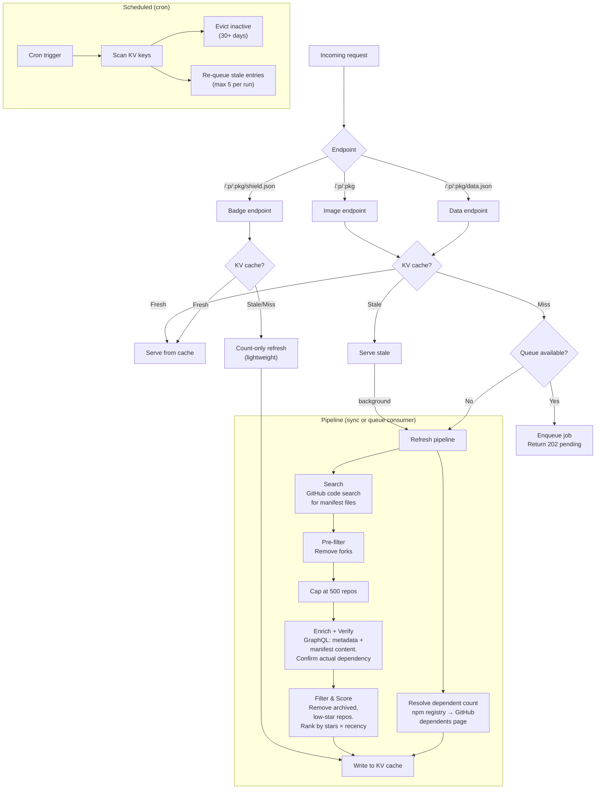

# `@usedby.dev/worker`

Cloudflare Worker that powers the usedby.dev API: data pipeline, embeddable image, badge, and JSON endpoints.

## How it works



### Pipeline stages

1. **Search** — Queries GitHub code search for `"packageName" filename:package.json` (up to 10 pages of 100 results). Matches include any `package.json` mentioning the name, which can produce false positives (mentions in descriptions, scripts, partial name matches).
2. **Resolve dependent count** _(parallel with search)_ — Fetches the npm registry to resolve the package's GitHub repo, then scrapes GitHub's `/:owner/:repo/network/dependents` page to extract the total repository dependent count. This adds 2 subrequests but zero latency since it runs concurrently with search.
3. **Pre-filter** — Removes forks. Fork status from code search is reliable, so filtering early saves enrichment budget.
4. **Cap** — Slices to 500 repos to stay within the enrichment budget (10 GraphQL batches of 50).
5. **Enrich + Verify** — A single GraphQL query per batch fetches repo metadata (stars, archived status, last push) _and_ the matched `package.json` content via `object(expression: "HEAD:path")`. The file is parsed and verified: repos where the package is not listed in `dependencies`, `devDependencies`, `peerDependencies`, or `optionalDependencies` are discarded as false positives. This costs zero additional subrequests.
6. **Filter & Score** — Removes archived repos and those with fewer than 5 stars. Remaining repos are ranked by `stars * recency_multiplier` (half-life decay over 1 year).
7. **Write to KV** — Stores repos, dependent count, version distribution, and metadata. Appends a daily snapshot for trending history.

### Queue consumer

On a cache miss, the data endpoint enqueues a `PipelineMessage` to a Cloudflare Queue instead of running the pipeline synchronously. The queue consumer:

1. Validates the message
2. Runs the full pipeline
3. Writes results to KV and appends a history snapshot
4. Deletes the lock key

Messages are retried after 30 seconds on failure. Duplicate enqueues are harmless — the consumer is idempotent.

### Scheduled refresh

A cron trigger scans all KV keys and:

- **Evicts** entries not accessed in 30+ days
- **Re-queues** stale entries (max 5 per run, oldest first)
- Stops early if GitHub rate-limited

## Endpoints

### Data

```
GET /:platform/:package/data.json
```

Returns the full dependent data for a package as JSON. This is the primary endpoint consumed by the web app.

| Status | Meaning                                         |
| ------ | ----------------------------------------------- |
| `200`  | Data ready                                      |
| `202`  | Pending — pipeline is running in the background |
| `404`  | Package not found                               |

**Response (200):**

```json
{
  "package": "dinero.js",
  "platform": "npm",
  "dependentCount": 97,
  "fetchedAt": "2025-01-15T12:00:00.000Z",
  "repos": [
    {
      "fullName": "org/repo",
      "owner": "org",
      "name": "repo",
      "stars": 12000,
      "lastPush": "2025-01-10T08:00:00.000Z",
      "avatarUrl": "https://avatars.githubusercontent.com/u/123",
      "score": 11400,
      "version": "2.0.0"
    }
  ],
  "versionDistribution": {
    "2.0.0": 42,
    "1.9.0": 28
  }
}
```

### Image

```
GET /:platform/:package
```

Returns an embeddable SVG image. Example: `GET /npm/dinero.js`

| Parameter | Type    | Default  | Description                                                       |
| --------- | ------- | -------- | ----------------------------------------------------------------- |
| `max`     | integer | `100`    | Number of dependents to display (1–100).                          |
| `style`   | string  | `mosaic` | `mosaic` (avatar grid) or `detailed` (cards with name and stars). |
| `sort`    | string  | `score`  | `score` (stars × recency) or `stars` (raw star count).            |
| `theme`   | string  | `auto`   | `auto`, `light`, or `dark`.                                       |

### Badge

```
GET /:platform/:package/shield.json
```

Returns a [Shields.io endpoint badge](https://shields.io/badges/endpoint-badge) JSON response.

```
https://img.shields.io/endpoint?url=https://api.usedby.dev/npm/dinero.js/shield.json
```

Uses a lightweight count-only refresh on cache miss (no search or enrichment), so it's cheap and fast.

### Supported registries

| Platform   | Example                       |
| ---------- | ----------------------------- |
| `npm`      | `/npm/dinero.js`              |
| `rubygems` | `/rubygems/rails`             |
| `pypi`     | `/pypi/django`                |
| `cargo`    | `/cargo/serde`                |
| `composer` | `/composer/laravel/framework` |
| `go`       | `/go/gorilla/mux`             |

## Caching

All endpoints use a stale-while-revalidate strategy:

- **Fresh**: 24 hours (12 hours for count-only entries)
- **Stale**: served immediately, refresh in background
- **Eviction**: 30 days without access

HTTP responses are also cached via Cloudflare's edge cache (`Cache-Control: max-age=86400`).

## Development

Create a `.dev.vars` file with your GitHub token:

```
GITHUB_TOKEN=ghp_your_token_here
```

Then start the local server:

```sh
npm run dev
```

The worker runs at [http://localhost:8787](http://localhost:8787).

To clear the local KV cache:

```sh
rm -rf .wrangler/state
```

## Deployment

```sh
npm run deploy
```

Requires `GITHUB_TOKEN` set via `wrangler secret put GITHUB_TOKEN`.

## Testing

```sh
npm test
```
