# `@usedby.dev/worker`

Cloudflare Worker that serves the embeddable image endpoint and handles the data pipeline.

## How it works

```mermaid
flowchart TD
    A["Incoming request<br/>GET /:platform/:package"] --> B{KV cache?}
    B -- Fresh --> C[Serve cached SVG]
    B -- Stale --> D[Serve stale SVG]
    D -- background --> E[Refresh pipeline]
    B -- Miss --> E

    E --> F["Search<br/>GitHub code search<br/>for package.json files"]
    F --> G["Enrich<br/>GitHub GraphQL API<br/>50 repos per request"]
    G --> H["Filter & Score<br/>Remove forks, archived,<br/>low-star repos.<br/>Rank by stars × recency"]
    H --> I[Fetch avatars]
    I --> J[Render SVG mosaic]
    J --> K[Write to KV cache]
```



## Endpoint

```
GET /:platform/:package
```

Example: `GET /npm/dinero.js` returns an SVG image.

## Development

Create a `.dev.vars` file with your GitHub token:

```
GITHUB_TOKEN=ghp_your_token_here
```

Then start the local server:

```sh
npm run dev
```

The worker runs at [http://localhost:8787](http://localhost:8787).

To clear the local KV cache:

```sh
rm -rf .wrangler/state
```

## Deployment

```sh
npm run deploy
```

Requires `GITHUB_TOKEN` set via `wrangler secret put GITHUB_TOKEN`.

## Testing

```sh
npm test
```
