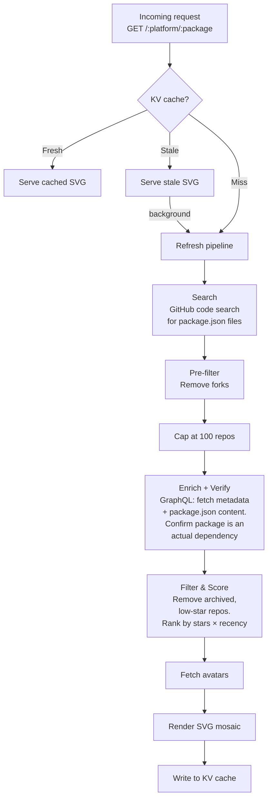

# `@usedby.dev/worker`

Cloudflare Worker that serves the embeddable image endpoint and handles the data pipeline.

## How it works



### Pipeline stages

1. **Search** — Queries GitHub code search for `"packageName" filename:package.json` (up to 5 pages of 100 results). Matches include any `package.json` mentioning the name, which can produce false positives (mentions in descriptions, scripts, partial name matches).
2. **Pre-filter** — Removes forks. Fork status from code search is reliable, so filtering early saves enrichment budget.
3. **Cap** — Slices to 100 repos to stay within Cloudflare Workers' 50-subrequest limit (2 GraphQL batches of 50).
4. **Enrich + Verify** — A single GraphQL query per batch fetches repo metadata (stars, archived status, last push) _and_ the matched `package.json` content via `object(expression: "HEAD:path")`. The file is parsed and verified: repos where the package is not listed in `dependencies`, `devDependencies`, `peerDependencies`, or `optionalDependencies` are discarded as false positives. This costs zero additional subrequests.
5. **Filter & Score** — Removes archived repos and those with fewer than 5 stars. Remaining repos are ranked by `stars * recency_multiplier` (half-life decay over 1 year).
6. **Fetch avatars** — Downloads avatar images for the top results.
7. **Render** — Produces an SVG mosaic and writes it to KV cache.

## Endpoint

```
GET /:platform/:package
```

Example: `GET /npm/dinero.js` returns an SVG image.

### Query parameters

| Parameter | Type    | Default  | Description                                                                                                                                                     |
| --------- | ------- | -------- | --------------------------------------------------------------------------------------------------------------------------------------------------------------- |
| `max`     | integer | `35`     | Number of dependents to display. Higher values use more subrequests (each avatar = 1); the default is tuned to the Cloudflare Workers free-plan budget.         |
| `style`   | string  | `mosaic` | Rendering style. `mosaic` shows an avatar-only grid (10 columns, 70px avatars). `detailed` shows a 4-column card layout with avatar, repo name, and star count. |
| `sort`    | string  | `score`  | Sort order. `score` ranks by `stars × recency_multiplier` (composite score). `stars` ranks by raw star count.                                                   |
| `theme`   | string  | `auto`   | Color theme. `auto` adapts to the user's system preference via `prefers-color-scheme`. `light` and `dark` force a specific mode.                                |

## Development

Create a `.dev.vars` file with your GitHub token:

```
GITHUB_TOKEN=ghp_your_token_here
```

Then start the local server:

```sh
npm run dev
```

The worker runs at [http://localhost:8787](http://localhost:8787).

To clear the local KV cache:

```sh
rm -rf .wrangler/state
```

## Deployment

```sh
npm run deploy
```

Requires `GITHUB_TOKEN` set via `wrangler secret put GITHUB_TOKEN`.

## Testing

```sh
npm test
```
